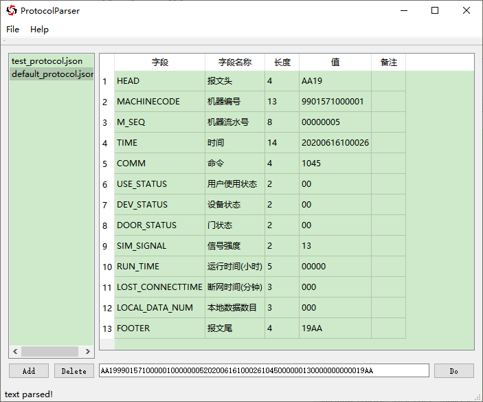
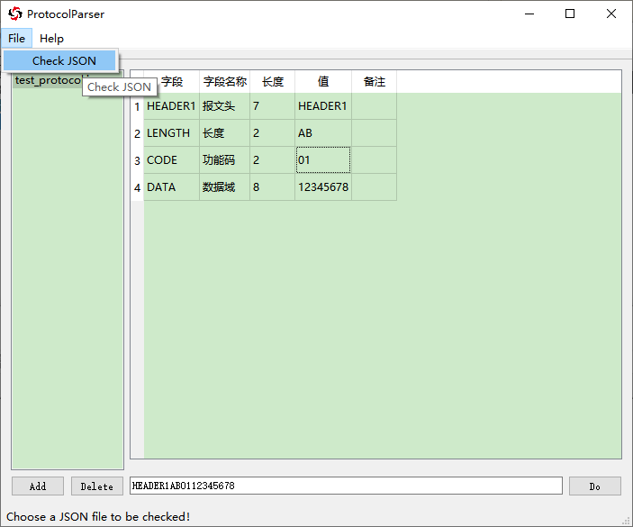
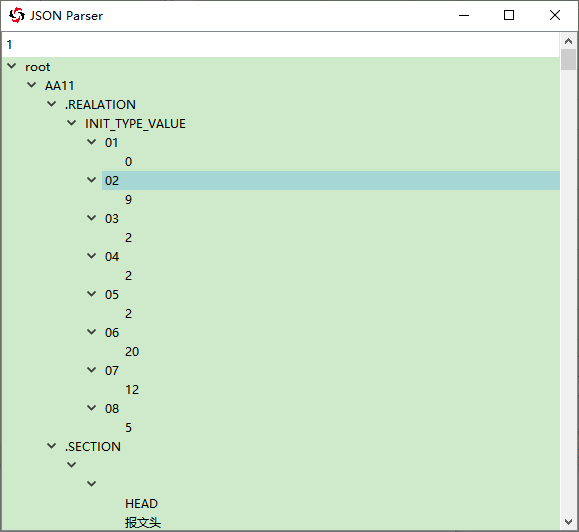

# ProtocolParser


## 软件截面




## 使用说明
- 点击 `Add`，添加协议配置文件，否则使用默认的配置文件（`for self-used`）；上边的列表会显示加载的配置文件
- 点击 `Delete`，删除不需要的配置文件
- 文本框输入需要解析的协议，回车或点击 `Do` 解析
- `model` 显示被解析的结果，若解析不成功会提示错误


- 在添加协议之前，可以使用 `File` -> `Check JSON` 检查格式是否正确，若正确会显示成树，`该项仅检查是否符合 QT 的 json 规范`




### 基础应用

协议格式
| 报文头 | 长度 | 数据域 |
|:------:|:---:|:-----:|
|    7   |  2  |   8   |
| HEADER1 | 08 | 12345678 |

对应的配置文件如下：
``` json
{
  "HEADER_LENGTH" : 7,

  "HEADER1" :
  {
    ".SECTION":
    [
      ["HEADER1", "报文头", 7],
      ["LENGTH", "长度", 2],
      ["DATA", "数据域", 8]
    ]
  }
}
```
- HEADER_LENGTH: 报文头长度
- .SECTION: 协议字段描述，遵循 [字段名，说明，字段长度] 的顺序

> 测试协议：
> - HEADER10212345678


### 高级应用
如果协议有同一个报文头，不同的功能码细分具体功能

功能码 = 01，数据长度 = 8
| 报文头 | 功能码 | 数据域 |
|:------:|:---:|:-----:|
|    7   |  2  |   8   |
| HEADER1 | 01 | 12345678 |

功能码 = 02，数据长度 = 4
| 报文头 | 功能码 | 数据域 |
|:------:|:---:|:-----:|
|    7   |  2  |   4   |
| HEADER1 | 02 | 1234 |

对应的配置文件如下：
``` json
{
  "HEADER_LENGTH" : 7,

  "HEADER1" :
  {
    ".SECTION" :
    [
      ["HEADER1", "报文头", 7],
      ["CODE", "功能码", 2],
      ["DATA", "数据域", "CODE"]
    ],

    ".REALATION":
    {
      "DATA": {"01":8, "02":4}
    }
  }
}
```

- `数据` 字段的长度依赖于 `功能码` 字段
- 在 `字段长度` 一栏  天上所依赖的字段名
- .REALATION: 未确定的字段名:{依赖的字段值:未确定的字段值}

> 测试协议：
> - HEADER10112345678
> - HEADER1021234


### 进阶应用

可以分成多个配置文件，添加进配置列表，避免一个配置文件过大
