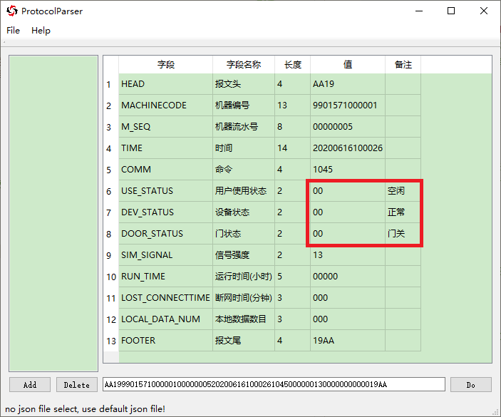

# ProtocolParser 

一个好的工具应允许用户自定义 (Give us opportunity to draw with our amazing imagination)

## 版本
- QT5.15.2-MinGW64

## 软件截面


## 使用说明
- 点击 `Add`，添加协议配置文件，否则使用默认的配置文件（`for self-used`）；上边的列表会显示加载的配置文件
- 点击 `Delete`，删除不需要的配置文件
- 文本框输入需要解析的协议，回车或点击 `Do` 解析
- `model` 显示被解析的结果，若解析不成功会提示错误


- 在添加协议之前，可以使用 `File` -> `Check JSON` 检查格式是否正确，若正确会显示成树，`该项仅检查是否符合 QT 的 json 规范，可能会存在细微兼容性问题（比如最后一个 object 后不能存在多余的逗号）`


### 基础应用

协议格式
| 报文头 | 长度 | 数据域 |
|:------:|:---:|:-----:|
|    7   |  2  |   8   |
| HEADER1 | 08 | 12345678 |

对应的配置文件如下：
``` json
{
  "HEADER_LENGTH" : 7,

  "HEADER1" :
  {
    ".SECTION":
    [
      ["HEADER1", "报文头", 7],
      ["LENGTH", "长度", 2],
      ["DATA", "数据域", 8]
    ]
  }
}
```
- HEADER_LENGTH: 报文头长度
- .SECTION: 协议字段描述，遵循 [字段名，说明，字段长度] 的顺序

> 协议测试用例：
> - HEADER10212345678


### 高级应用
如果协议有同一个报文头，不同的功能码细分具体功能

功能码 = 01，数据长度 = 8
| 报文头 | 功能码 | 数据域 |
|:------:|:---:|:-----:|
|    7   |  2  |   8   |
| HEADER1 | 01 | 12345678 |

功能码 = 02，数据长度 = 4
| 报文头 | 功能码 | 数据域 |
|:------:|:---:|:-----:|
|    7   |  2  |   4   |
| HEADER1 | 02 | 1234 |

对应的配置文件如下：
``` json
{
  "HEADER_LENGTH" : 7,

  "HEADER1" :
  {
    ".SECTION" :
    [
      ["HEADER1", "报文头", 7],
      ["CODE", "功能码", 2],
      ["DATA", "数据域", "CODE"]
    ],

    ".REALATION":
    {
      "DATA": {"01":8, "02":4}
    }
  }
}
```
- `数据` 字段的长度依赖于 `功能码` 字段
- 在 `字段长度` 一栏  天上所依赖的字段名
- .REALATION: 未确定的字段名:{依赖的字段值:未确定的字段值}

> 协议测试用例：
> - HEADER10112345678
> - HEADER1021234


### 进阶应用
可以分成多个配置文件，添加进配置列表，避免一个配置文件过大；  
只要配置文件足够多，就能解析任意报文。

#### 添加 .NOTE
有些字段某些数值有特殊意义，那我们就可以为此添加备注说明，十七更为含义更为直观。
如下例子所示添加 `.NOTE` 字段。

``` json
{
  "HEADER_LENGTH" : 4,

  "AA19" :
  {
    ".SECTION":
    [
      ["HEAD", "报文头", 4],
      ["MACHINECODE", "机器编号", 13],
      ["M_SEQ", "机器流水号", 8],
      ["TIME", "时间", 14],
      ["COMM", "命令", 4],
      ["USE_STATUS", "用户使用状态", 2],
      ["DEV_STATUS", "设备状态", 2],
      ["DOOR_STATUS", "门状态", 2],
      ["SIM_SIGNAL", "信号强度", 2],
      ["RUN_TIME", "运行时间(小时)", 5],
      ["LOST_CONNECTTIME", "断网时间(分钟)", 3],
      ["LOCAL_DATA_NUM", "本地数据数目", 3],
      ["FOOTER", "报文尾", 4]
    ],

    ".NOTE":
    {
      "USE_STATUS":{"00":"空闲", "01":"APP 正在使用", "02":"正在上袋", "03":"正在"},
      "DEV_STATUS":{"00":"正常", "01":"电机故障"},
      "DOOR_STATUS":{"00":"门关", "01":"门开"}
    }
  }
}
```



## 说明
- 程序未作严格数据安全处理

## TODO
- 增加字段特殊数值的说明（已完成）
- 增加网络功能，网络版 POST-MAN
